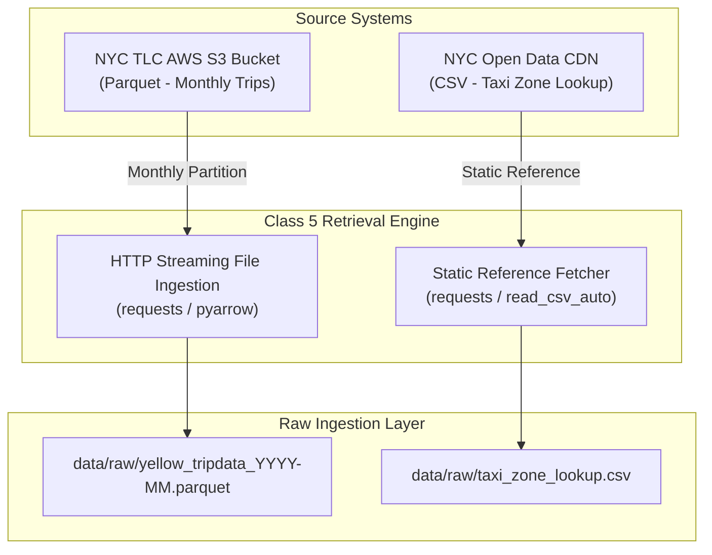
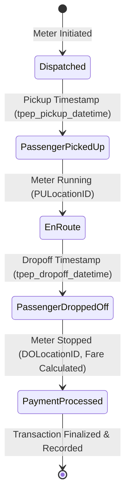
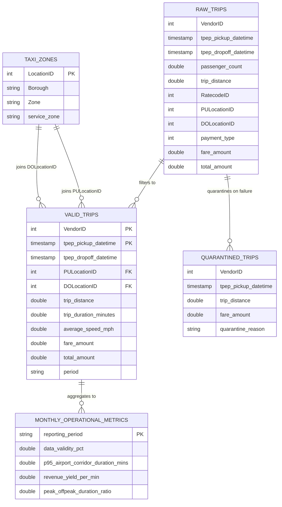
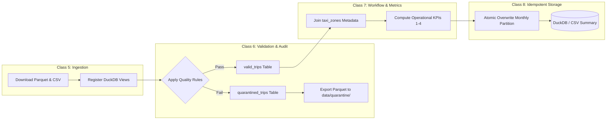

# Source Mapping, Workflow Model & Data Schema

**NYC TLC Operational Dependability Pipeline (Track B)**

## 1. Source System Mapping

The executable pipeline ingests two sources across two file retrieval modes. TLC payment/rate-code documentation may inform interpretation, but is not downloaded or joined by the implementation.

### Source System Inventory

| Attribute | Source 1: Trip Records | Source 2: Zone Lookup |
|---|---|---|
| **System Name** | NYC TLC Yellow Taxi Trip Records | NYC TLC Taxi Zone Lookup |
| **Storage Format** | Apache Parquet | CSV |
| **Data Owner** | NYC Taxi & Limousine Commission | NYC TLC / GIS reference data |
| **Data Grain** | 1 record per completed taxi trip | 1 record per TLC location zone |
| **Key(s)** | No uniqueness constraint is enforced by the pipeline; VendorID and pickup timestamp are available fields | LocationID |
| **Update Cadence** | Monthly | Infrequent / static reference |
| **Key Gaps & Limitations** | No pre-pickup wait, canceled trips, or GPS route breadcrumbs | Zone IDs aggregate areas; lookup has no exact trip route |

## 2. Trip Operational Workflow Model

The pipeline transforms static trip log rows into a stateful, event-driven workflow representing the lifecycle of an operational taxi trip.

### Lifecycle State Machine

### Event & Transition Mapping

| Workflow State | Event Trigger | Source Fields / Entities | Validation & State Checks |
|---|---|---|---|
| 1. Trip Initiation | Driver activates trip meter | VendorID, RatecodeID | Validate valid VendorID and active RatecodeID. |
| 2. Pickup | Passenger enters vehicle at origin | tpep_pickup_datetime, PULocationID | PULocationID NOT IN (264, 265) (Exclude unknown zones). |
| 3. En Route | Vehicle travels from origin to destination | trip_distance, calculated duration | • duration BETWEEN 1 AND 360 mins • trip_distance BETWEEN 0 AND 200 miles • average_speed <= 80 mph |
| 4. Dropoff | Passenger reaches destination | tpep_dropoff_datetime, DOLocationID | tpep_dropoff_datetime > tpep_pickup_datetime. |
| 5. Settlement | Fare calculation and payment execution | fare_amount, extra, mta_tax, tip_amount, tolls_amount, total_amount, payment_type | fare_amount >= 0 AND total_amount >= 0. |

## 3. Relational & Analytical Data Schema

The downstream pipeline transforms ingested raw records into a dimensional model inside DuckDB (`data/processed/tlc_analytics.duckdb`).

## 4. End-to-End Execution & Validation Pipeline Architecture

The complete data pipeline follows a strict, idempotent execution pattern from ingestion through metric generation.

### Pipeline Decision Logic & Error Handling

- **Staged Raw Retrieval:** Downloads are written to `.part` files and renamed only after completion and byte-count verification when the source provides `Content-Length`.
- **Audit Traceability:** Ingested raw records are never altered in place. The current SQL partitions ordinary true/false validation results into valid and quarantine tables; null-valued rule evaluations can fall into neither table and require explicit handling for a strict completeness guarantee.
- **Idempotency Guarantee:** Writes to `monthly_operational_metrics` delete any pre-existing records matching the target `--reporting_period` before inserting new calculations, making repeated successful runs non-duplicating. The metric table update and CSV export are not one atomic transaction.
- **Partition Isolation:** Quarantined outputs are saved with monthly tags (`quarantine_YYYY-MM.parquet`), maintaining clean audit boundaries for operational debugging.

## 5. Retrieval Completeness and Failure Contract

The trip file is retrieved from the TLC CloudFront Parquet endpoint and the zone file from the TLC static CSV endpoint. A successful retrieval means HTTP success, at least one byte written, and matching `Content-Length` when present. A failed retrieval raises an error and leaves the prior raw file untouched. The `--no-download` mode makes reruns deterministic against already preserved raw inputs and is recommended for offline review.
